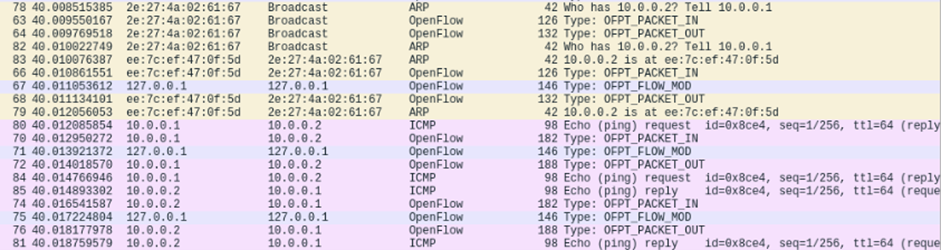

# Mininet

[Mininet](https://github.com/mininet/mininet) is a network emulator designed for creating virtual networks on a single machine, whether it's a laptop, PC, or a cloud environment. It enables rapid prototyping, development, and testing of Software Defined Networking (SDN) systems by emulating a network of virtual hosts, switches, controllers, and links. It supports the development and experimentation with OpenFlow and other SDN protocols. Mininet is used in research, development, and education for SDN.

Mininet runs real kernel, switch, and application code, providing a realistic testbed for SDN applications. It offers a Python API for creating and experimenting with different network topologies, making it highly customizable. It supports interactive development, testing, and debugging, with support for common networking tools and commands. SDN applications and controllers developed and tested in Mininet can be easily transferred to real hardware with minimal changes, making it a cost-effective solution for SDN experimentation.

## Installing Mininet

Mininet provides a pre-packaged VM that includes all necessary tools and binaries, or it can be installed natively from source on a compatible Linux distribution. Follow [these](https://mininet.org/download/) instructions to install Mininet on your machine.

Once you install Mininet, verify the installation by invoking the following:

```bash
sudo mn --test pingall
```

This command runs a simple test to ensure Mininet is functioning correctly by creating a minimal topology and performing a ping test.

## Simple Mininet Topology

Start Mininet with the default topology:

```bash
sudo mn
```

Mininet creates a topology with 1 OpenFlow switch (`s1`) and 2 hosts (`h1` and `h2`):

```text
h1-eth0---eth1-s1-eth2---eth0-h2
```

Run the ping test from the Mininet CLI by using `pingall` command.

```bash
mininet> pingall
```

You can issue various Mininet-CLI commands. The command `nodes` yields the following output:

```bash
mininet> nodes
available nodes are:
c0 h1 h2 s1
```

By convention, Mininet host names begin with `h` and switch names begin with `s`; numbering begins with `1`. The node `c0` is the controller for the switch `s1`.

The command `intfs` lists the interfaces for each of the nodes:

```bash
mininet> intfs
h1: h1-eth0
h2: h2-eth0
s1: lo,s1-eth1,s1-eth2
c0:
```

The command `links` lists the connections:

```bash
mininet> links
h1-eth0<->s1-eth1 (OK OK)
h2-eth0<->s1-eth2 (OK OK)
```

The most useful command is `net`, which shows the nodes, the interfaces and the connections:

```bash
mininet> net
h1 h1-eth0:s1-eth1
h2 h2-eth0:s1-eth2
s1 lo:  s1-eth1:h1-eth0 s1-eth2:h2-eth0
c0
```

The `dump` command is a helpful debugging tool that provides detailed information about the network's current state. It displays the status and configuration of all nodes in the network, including hosts, switches, and controllers. This information can be used to verify the setup and troubleshoot issues.

```bash
mininet> dump
<Host h1: h1-eth0:10.0.0.1 pid=1507149>
<Host h2: h2-eth0:10.0.0.2 pid=1507151>
<OVSSwitch s1: lo:127.0.0.1,s1-eth1:None,s1-eth2:None pid=1507156>
<Controller c0: 127.0.0.1:6653 pid=1507142>
```

Mininet uses the default `OVSKernelSwitch`, which is an Open vSwitch (OVS) switch running in the Linux kernel.

To list all OVS switches, you can run the `ovs-vsctl` utility in the host OS (do not close mininet).

```bash
sudo ovs-vsctl show

3d5bc3b1-9694-476a-9b6c-16f6afed717e
    Bridge s1
        Controller "ptcp:6654"
        Controller "tcp:127.0.0.1:6653"
            is_connected: true
        fail_mode: secure
        Port s1-eth2
            Interface s1-eth2
        Port s1-eth1
            Interface s1-eth1
        Port s1
            Interface s1
                type: internal
    ovs_version: "2.13.8"
```

Note that the OVS switch is connected to the SDN controller running on `127.0.0.1:6653`.

## Running Commands on Nodes

To run commands on individual nodes, prefix the command name with the node name.

For example, to ping host `h2` from host `h1` we can invoke the following. Note that the name `h2` is recognized.

```bash
mininet> h1 ping h2 -c 5
```

Check the interfaces on host `h1`:

```bash
mininet> h1 ifconfig

h1-eth0: flags=4163<UP,BROADCAST,RUNNING,MULTICAST>  mtu 1500
        inet 10.0.0.1  netmask 255.0.0.0  broadcast 10.255.255.255
        inet6 fe80::a44d:1bff:febf:82af  prefixlen 64  scopeid 0x20<link>
        ether a6:4d:1b:bf:82:af  txqueuelen 1000  (Ethernet)
        RX packets 50  bytes 6185 (6.1 KB)
        RX errors 0  dropped 0  overruns 0  frame 0
        TX packets 18  bytes 1356 (1.3 KB)
        TX errors 0  dropped 0 overruns 0  carrier 0  collisions 0
```

The command shows that `h1` (or, more properly, `h1-eth0`) has IP address 10.0.0.1. The `ifconfig` command also shows the MAC address of `h1-eth0`. Note that interface `h1-eth0` is not seen by the host Linux when `ifconfig` is run, because it is specific to the network namespace of the host process.

In contrast, the switch by default runs in the root network namespace, so running a command on the switch is the same as running it from a regular terminal:

```bash
mininet> s1 ifconfig
```

By running ifconfig on the host OS, you should be able to see the switch interfaces:

```bash
s1-eth1: flags=4163<UP,BROADCAST,RUNNING,MULTICAST>  mtu 1500
        inet6 fe80::7491:d7ff:feab:b317  prefixlen 64  scopeid 0x20<link>
        ether 76:91:d7:ab:b3:17  txqueuelen 1000  (Ethernet)
        RX packets 33  bytes 2686 (2.6 KB)
        RX errors 0  dropped 0  overruns 0  frame 0
        TX packets 67  bytes 7788 (7.7 KB)
        TX errors 0  dropped 0 overruns 0  carrier 0  collisions 0

s1-eth2: flags=4163<UP,BROADCAST,RUNNING,MULTICAST>  mtu 1500
        inet6 fe80::d830:c2ff:fe37:3e85  prefixlen 64  scopeid 0x20<link>
        ether da:30:c2:37:3e:85  txqueuelen 1000  (Ethernet)
        RX packets 33  bytes 2686 (2.6 KB)
        RX errors 0  dropped 0  overruns 0  frame 0
        TX packets 67  bytes 7788 (7.7 KB)
        TX errors 0  dropped 0 overruns 0  carrier 0  collisions 0
```

Note that only the network is virtualized; each host process sees the same set of processes and directories.

For example, print the process list from a host process:

```bash
mininet> h1 ps -a
```

Open an interactive bash shell to `h1`:

```bash
mininet> h1 bash
```

And create a text file inside /tmp:

```bash
touch /tmp/sample.txt
```

You should be able to see this text file from both the host OS and host h2. This makes setup simple, but sometimes causes problems with applications that expect individualized configuration files in specified locations.

## Running Wireshark

We can take advantage of this simple `h1–s1–h2` network configuration to observe traffic with WireShark on a nearly idle network; by default, the Mininet nodes are not connected to the outside world. We can start WireShark inside `h2` in background mode, and set it to listen on interface `h2-eth0`.

```bash
mininet> h2 wireshark &
```

From host `h1`, ping host `h2` and observe the ICMP packets in WireShark.

```bash
mininet> h1 ping h2 -c 5
```

Now let us start WireShark on `s1` and listen on all interfaces.

```bash
mininet> s1 wireshark &
```

You will observe `OFPT_ECHO_REQUEST` and `OFPT_ECHO_REPLY` packets between the controller and the switch. The controller sends the `ECHO_REQUEST` to the switch and the switch replies with `ECHO_REPLY`. The OpenFlow protocol uses Echo Request and Echo Reply messages as a keep-alive mechanism to ensure that the connection between the controller and the switch is active. These messages also help the controller measure the round-trip time to the switch, which can be useful for performance monitoring and diagnostics.

From host `h1`, ping host `h2` again and observe packets on the switch.

```bash
mininet> h1 ping -c 1 h2
```

The first host `h1` sends an ARP request to find the MAC address of the second host `h2`. The ARP request is a broadcast packet, so it is sent out on the network. The switch `s1` receives the ARP request broadcast from `h1`. Since the switch does not have a matching flow entry for this ARP request packet, it needs to consult the controller for further instructions.

The switch `s1` encapsulates the ARP request packet in an `OFPT_PACKET_IN` message, and sends it to the controller. This message contains the ARP request packet and some metadata about the packet (e.g., ingress port). The controller receives the `OFPT_PACKET_IN` message, and decides to flood the ARP request to all other ports on the switch (except the port it came from). The controller sends an `OFPT_PACKET_OUT` message to the switch to instruct the switch to flood the ARP request packet to all other ports.

The second host `h2` receives the ARP request and sends an ARP reply with its MAC address. The switch receives the ARP reply from `h2`. The switch again does not have a matching flow entry for the ARP reply, so it sends another `OFPT_PACKET_IN` message to the controller with the ARP reply packet. The controller sends an `OFPT_PACKET_OUT` message to forward the ARP reply to `h1`. The controller may also send an `OFPT_FLOW_MOD` message to install flow entries for handling future ARP replies and subsequent ICMP packets directly on the switch.

Once `h1` knows the MAC address of `h2`, it sends an ICMP Echo Request to `h2`. The switch may send a `OFPT_PACKET_IN` message to the controller if it doesn't have a flow entry for this ICMP packet. The controller processes the packet and sends the necessary `OFPT_PACKET_OUT` and `OFPT_FLOW_MOD` messages. If you repeat the last ping, you should see a lower ping time for the second try. A flow entry covering ICMP ping traffic was previously installed in the switch, so no control traffic was generated, and the packets immediately pass through the switch.

```bash
mininet> h1 ping -c 1 h2
```



You can use the following command to display the flow entries in the OpenFlow switch connected to the OpenFlow controller. Note that port 6654 is an alternative port where the OpenFlow controller is configured to listen for OpenFlow messages from switches.

```bash
ovs-ofctl dump-flows tcp:127.0.0.1:6654
```

## Mininet Topology

In Mininet, topologies define the network's structure and how hosts, switches, and links are connected. Mininet comes with several predefined topologies, and users can also create custom ones. To list all available topologies in Mininet, you can check under `--topo` in:

```bash
sudo mn -h
```

| Topology Name | Class Name              |
|---------------|-------------------------|
| minimal       | MinimalTopo             |
| single        | SingleSwitchTopo        |
| reversed      | SingleSwitchReversedTopo|
| linear        | LinearTopo              |
| tree          | TreeTopo                |
| torus         | TorusTopo               |

To visualize these topologies, invoke `mn`, then get the output of `net` command and use [this](https://achille.github.io/mininet-dump-visualizer/) online tool.

**Minimal** topology is a single switch connected to two hosts. It is equivalent to the following. This can be used in simple scenarios where only basic communication between two hosts is needed. Useful for introductory tutorials and basic network function tests.

```bash
sudo mn --topo minimal
```

**Single** topology creates a single switch connected to multiple hosts. For example, to create a topology with 1 switch and 3 hosts invoke the following. Single topology is suitable for testing scenarios where all hosts are on the same local network and need to communicate through a single switch. It can be used for learning about switch behavior, ARP, and basic traffic flows.

```bash
sudo mn --topo single,3
```

**Reversed** topology is similar to the single topology but with reversed port numbers. This topology is useful for testing with specific port configurations and understanding the effects of port numbering on network behavior.

```bash
sudo mn --topo reversed,3
```

**Linear** topology creates a chain of switches, each connected to one host. This is useful for scenarios where nodes (hosts and switches) are connected in a series, such as in some linear sensor networks or simple backbone networks. IT is good for testing latency and throughput in linear networks.

```bash
sudo mn --topo linear,3
```

**Tree** topology creates a tree structure with a specified depth and fanout (number of child nodes per switch). This topology is ideal for representing hierarchical network structures like those found in data centers (e.g., fat-tree architectures) or organizational LANs with multiple layers of switches. It is useful for studying traffic aggregation, bottlenecks, and hierarchical network management.

```bash
sudo mn --topo tree,depth=3,fanout=2
```

**Torus** topology is a 2D grid of switches where the grid wraps around at the edges. This means that each switch is connected to four neighbors: one on the left, one on the right, one above, and one below. The wrapping around the edges ensures that switches on the boundaries are connected to switches on the opposite side, forming a continuous loop or donut shape. This topology is useful for testing mesh network performance, fault tolerance, and routing algorithms.

```bash
sudo mn --topo torus,3,3
```

In the above command, the first number shows the number of rows and the second number shows the number of columns in the tortus grid, where `--` represents horizontal links and `|` represents vertical links.

```text
s1x1 -- s1x2 -- s1x3
  |       |       |
s2x1 -- s2x2 -- s2x3
  |       |       |
s3x1 -- s3x2 -- s3x3
```

Wrap-around connections:

```text
s1x1 <--> s1x3, s1x1 <--> s3x1
s1x2 <--> s1x1, s1x2 <--> s3x2
s1x3 <--> s1x2, s1x3 <--> s3x3
s2x1 <--> s2x3, s2x1 <--> s1x1
s2x2 <--> s2x1, s2x2 <--> s1x2
s2x3 <--> s2x2, s2x3 <--> s1x3
s3x1 <--> s3x3, s3x1 <--> s2x1
s3x2 <--> s3x1, s3x2 <--> s2x2
s3x3 <--> s3x2, s3x3 <--> s2x3
```

## Mininet Custom Topology

Custom topologies are used when the predefined ones do not fit specific requirements. These can represent real-world networks, specific test scenarios, or experimental setups. Custom topologies allow for precise control over the network structure and behavior. Mininet provides a Python API that allows users to define custom topologies by sub-classing the `Topo` class and implementing the build method.

We have created a custom mininet topology in `mytopofile.py`.

You can invoke the script directly:

```bash
sudo /usr/bin/python3 /opt/mytopofile.py
```

Or invoke it using mn:

```bash
sudo mn --custom /opt/mytopofile.py --topo mytopo
```

Each Mininet Python file configures the network and then starts up the Mininet command-line interface (which is necessary to start commands on the various nodes). The use of self-contained Python files arguably makes the configurations easier to edit, and avoids the complex command-line arguments of many standard Mininet examples. The Python code uses what the Mininet documentation calls the mid-level API.

## MiniEdit (Mininet's GUI)

To create a custom topology, you can also use `MiniEdit` which is Mininet’s graphical user interface. You can find `miniedit.py` in the example directory. Refer to [this](https://brianlinkletter.com/2015/04/how-to-use-miniedit-mininets-graphical-user-interface/) for more information.

```bash
sudo /usr/bin/python3 /opt/mininet/examples/miniedit.py
```

## Mininet MAC Option

By default, hosts start with randomly assigned MAC addresses. This can make debugging tough, because every time the Mininet is created, the MACs change, so correlating control traffic with specific hosts is tough. The `--mac` option sets the host MAC and IP address to small, unique, easy-to-read IDs. Note that the MACs for switch data ports reported by Linux will remain random. This is because you can assign a MAC to a data port using OpenFlow.

```bash
sudo mn --mac
...
mininet> h1 ifconfig

h1-eth0: flags=4163<UP,BROADCAST,RUNNING,MULTICAST>  mtu 1500
        inet 10.0.0.1  netmask 255.0.0.0  broadcast 10.255.255.255
        inet6 fe80::200:ff:fe00:1  prefixlen 64  scopeid 0x20<link>
        ether 00:00:00:00:00:01  txqueuelen 1000  (Ethernet)
        RX packets 25  bytes 3411 (3.4 KB)
        RX errors 0  dropped 0  overruns 0  frame 0
        TX packets 8  bytes 716 (716.0 B)
        TX errors 0  dropped 0 overruns 0  carrier 0  collisions 0
```

## POX SDN Controller

[POX](https://github.com/noxrepo/pox) is an open-source development platform for Python-based SDN control applications. It is a controller framework that enables developers to build and experiment with network applications in an SDN environment. POX provides a variety of modules that can be used to create network control applications, such as topology discovery, forwarding, and learning switches.

POX is already present in the Mininet package. Go to the POX folder and invoke the following. It starts the POX controller on port 6633 and loads the `l2_learning` module that implements a simple learning switch.

```bash
cd /opt/mininet/pox
./pox.py forwarding.l2_learning
```

Start Mininet and connect to the POX controller:

```bash
sudo mn --controller=remote,ip=127.0.0.1,port=6633
```
